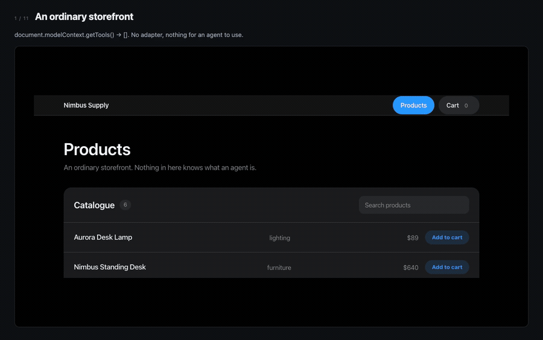

# The Studio demo



*(`studio.mp4` is the same thing, sharper.)*

Eleven frames, and every one of them is a screenshot of a real browser doing the
real thing:

1. **An ordinary storefront** — `document.modelContext.getTools()` returns `[]`.
   The adapter that ships for this site is switched off first, so the page really
   has nothing an agent can use. Whatever exists at the end is only what the
   Studio produced.
2. **Press Record** — the popup, reporting on the page in front of it.
3. **Do the thing you want the agent to do** — a click and an input, performed as
   real DOM events. The recorder is listening to those, not to keystrokes.
4. **The Studio has the workflow** — selectors taken from the site's own stable
   attributes.
5. **Name it, and say what it does** — the description is what an agent reads to
   decide when to use the tool.
6. **The value you typed becomes an argument** — `cable` was an example, not a
   constant.
7. **Add the step the recorder could not see** — reading the answer back is not an
   interaction, so nobody clicked it. The author adds a `readList`.
8. **Check the selectors against the live page** — ambiguous selectors are refused
   at runtime, so they are caught here instead.
9. **A person approves the origins and capabilities** — the Studio asking is a
   request. Nothing installs without this.
10. **Reload: the tool an agent can see** — `find_products` is registered with
    WebMCP, and the site was never touched.
11. **An agent outside the page runs it** — invoked over the DevTools `WebMCP`
    domain, answering with a product out of the real catalogue.

## Regenerating it

```bash
pnpm build
pnpm demo:studio
```

`tools/demo/studio.mjs` drives the whole thing: it starts a browser with the
extension loaded, disables the shipped adapter, records the workflow, fills in
the Studio, approves the confirmation, and then invokes the resulting tool from
outside the page. Each frame is captured as it happens and the slides are
assembled with ffmpeg.

Nothing in it is staged, which is the property that makes it worth having: **if
the product breaks, the demo cannot be produced.** The run fails loudly if the
page starts with tools already registered, if the Studio does not open, if no
confirmation appears, if the tool never registers, or if it answers with an
error.
